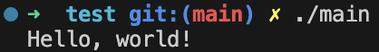

# Introduction au Language C

## Arborescence

```
IntroductionLanguageC/
└── test/
    └── main.c
```

Contenu du fichier `main.c`:

```c
#include <stdio.h>

int main()
{
    printf("Hello, world!\n");
    return 0;
}
```

## Prérequis : Installer `gcc`

### macOS

```sh
brew install gcc
```

### Linux

```sh
sudo apt update
sudo apt install build-essential
```

### Windows

```sh
echo "pas Windows... faut pas déconner quand même :)"
```

## Utilisation avec Visual Studio Code

1. **Installer Visual Studio Code** :
   [https://code.visualstudio.com](https://code.visualstudio.com)

2. **Installer l’extension C/C++ officielle** :

   - Ouvrir VS Code
   - Aller dans l’onglet Extensions
     - Windows/Linux : `Ctrl + Shift + X`
     - macOS : `Cmd + Shift + X`
   - Rechercher et installer : `C/C++` (par Microsoft)
     

3. **Ouvrir le dossier contenant `main.c`** :

   - Ouvre le dossier `IntroductionLanguageC` dans VS Code

4. **Compilation manuelle** :

   - Ouvre un terminal dans VS Code  
     

   - Se placer dans le répertoire de travail `test` :

     ```sh
     cd test
     ```

   - Compiler le fichier `main.c` :
     ```sh
     gcc main.c -o main
     ```

5. **Exécution** :

   - Toujours via le terminal :
     ```sh
     ./main
     ```

## Résultat attendu

```
Hello, world!
```


